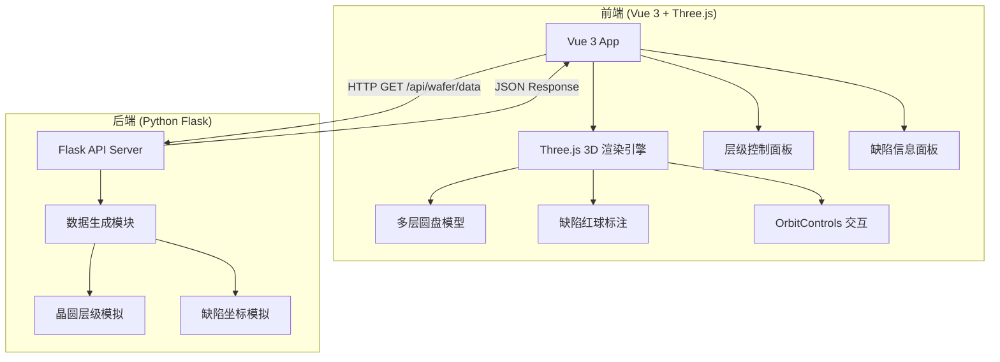
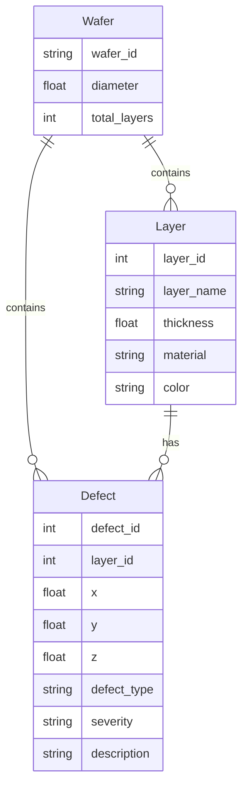

## 1. 架构设计



## 2. 技术说明

- 前端：Vue 3 + TypeScript + Three.js + Vite
- 初始化工具：vite-init (vue-ts 模板)
- 后端：Python 3 + Flask（独立文件夹）
- 数据库：无，使用 Python 模拟数据生成
- 3D 库：three + @types/three

## 3. 路由定义
| 路由 | 用途 |
|------|------|
| / | 主页，3D 晶圆可视化 |

## 4. API 定义

### GET /api/wafer/data

**响应 Schema：**

```typescript
interface WaferLayer {
  layer_id: number
  layer_name: string
  thickness: number
  material: string
  color: string
}

interface Defect {
  defect_id: number
  layer_id: number
  x: number
  y: number
  z: number
  defect_type: "scratch" | "particle" | "crack" | "void" | "contamination"
  severity: "low" | "medium" | "high"
  description: string
}

interface WaferData {
  wafer_id: string
  wafer_diameter: number
  total_layers: number
  layers: WaferLayer[]
  defects: Defect[]
}
```

## 5. 服务器架构图

```mermaid
flowchart LR
    "Flask Route" --> "Data Generator"
    "Data Generator" --> "Layer Simulator"
    "Data Generator" --> "Defect Simulator"
    "Layer Simulator --> "JSON Response"
    "Defect Simulator" --> "JSON Response"
```

## 6. 数据模型

### 6.1 数据模型定义



### 6.2 项目目录结构

```
ck9/
├── backend/                    # Python 后端
│   ├── app.py                  # Flask 主入口
│   ├── data_generator.py       # 数据生成模块
│   └── requirements.txt        # Python 依赖
├── frontend/                   # Vue 3 前端
│   ├── src/
│   │   ├── components/
│   │   │   ├── WaferScene.vue      # Three.js 3D 场景
│   │   │   ├── LayerPanel.vue      # 层级控制面板
│   │   │   ├── DefectInfo.vue      # 缺陷详情面板
│   │   │   └── StatsBar.vue        # 统计概览栏
│   │   ├── composables/
│   │   │   └── useWaferData.ts     # 数据获取逻辑
│   │   ├── types/
│   │   │   └── wafer.ts            # 类型定义
│   │   ├── App.vue
│   │   └── main.ts
│   ├── package.json
│   └── vite.config.ts
└── .trae/documents/
```
